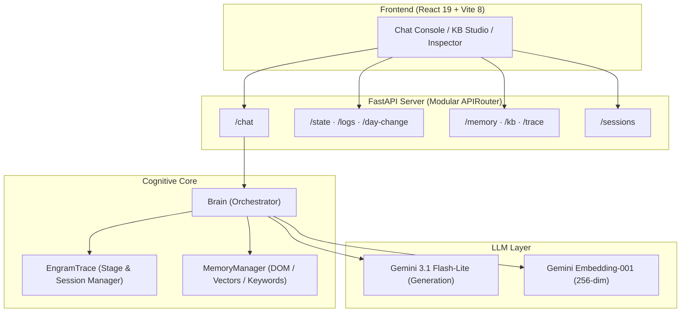

# EngramTrace

A non-parametric cognitive memory system that augments Large Language Models with persistent, structured long-term memory. Unlike standard RAG systems that use flat vector stores, EngramTrace maintains a **living HTML document** as its knowledge base, where the DOM structure itself encodes semantic relationships.

## 🧠 Cognitive Philosophy
EngramTrace mimics the human biological cycle of memory consolidation:
1. **Encoding**: Conversations are buffered in a temporary Stage Log.
2. **Retrieval (Ecphory)**: Relevant knowledge is retrieved via dual-mode search — hierarchical vector similarity combined with NLTK-powered keyword search.
3. **Reconsolidation**: When a topic shift (drift) is detected, the buffer is synthesized and merged back into the long-term HTML structure.

---

## 🏗 Architecture Overview



### Key Technical Innovations
- **Hierarchical Embedding Summation**: Paragraph vectors are blended with their structural ancestors (70% local / 30% parent), giving each leaf node implicit awareness of its context within the knowledge tree.
- **Dual Retrieval Strategy**: Semantic vector search (with top-3 fallback) + NLTK-powered keyword search (lemmatized, stop-word filtered) activated on stage transitions.
- **Dual-Threshold Control**: Independent triggers for **Stage Drift** (topic switching, default 0.83) and **Semantic Search** (knowledge retrieval, default 0.80).
- **Multi-Session Support**: Named chat sessions with independent stage/session logs and per-session ephemeral state, sharing a common knowledge base.
- **Homeostatic Day System**: Automatic compression and reorganization of the entire knowledge base after prolonged inactivity (>67 min).

---

## 🚀 System Pipeline

### 1. Initialization (Atomization)
The system converts unstructured information into a structured HTML document via LLM. Every node is assigned a deterministic SHA-256-based ID, and hierarchical embeddings are batch-generated and summed top-down using memoization to map the initial conceptual landscape.

### 2. Retrieval & Inference (In-Stage)
Every interaction triggers a drift check against the running mean of recent Q-A pair embeddings (stack of 3). If the topic is consistent, relevant context is retrieved via Ecphory — a combination of vectorized cosine similarity search and NLTK keyword matching. The query vector is blended with the last Q-A vector (70/30) to maintain topic trajectory. Responses can be generated with `no_search` (restrict to current trace) or `no_memorize` (skip stage log) modes.

### 3. Consolidation (Transition)
When topic drift is detected or the stage log reaches 15 entries, the system synthesizes the conversation buffer via LLM and grafts updated/new HTML fragments into the DOM through surgical rewrite mutations. Root protection prevents catastrophic full-KB overwrites.

### 4. Homeostasis (Day Change)
On significant time gaps (>4000s), the system performs a restructuring pass. The LLM reorganizes and deduplicates the entire KB while preserving substantive content and giving priority to the most recent information.

---

## 🖥 Frontend Features

- **Chat Console**: Multi-line input, ReactMarkdown rendering, live server log streaming (polled every 400ms), inference control toggles
- **KB Studio**: 
  - **HTML Editor** — CodeMirror with Catppuccin theme, syntax highlighting, source/preview toggle, save-to-backend with full embedding rebuild
  - **DOM Graph** — Interactive React Flow visualization with dagre auto-layout, color-coded nodes by tag type, click-to-toggle trace membership, retrieved node ancestry highlighting
- **Data Inspector**: Read-only JSON view of trace set, stage log, and session log
- **Session Sidebar**: Create, switch, and delete named chat sessions
- **Header Controls**: Drift/Search threshold inputs, selective memory wipe, force day change

---

## 🛠 Tech Stack

| Layer | Technology |
|-------|-----------|
| **Backend** | FastAPI, LangChain, BeautifulSoup4, NumPy, NLTK |
| **Frontend** | React 19, Vite 8, React Flow, CodeMirror, dagre, react-markdown |
| **AI** | Google Gemini 3.1 Flash-Lite, Gemini Embedding-001 (256-dim) |
| **Evaluation** | LongMemEval benchmark, GPT-4o answer scoring |

---

## 📊 Evaluation

EngramTrace is benchmarked against **LongMemEval**, a standardized evaluation framework for long-term conversational memory:

```bash
# Run full evaluation
python evaluate_engramtrace.py --dataset LongMemEval/data/longmemeval_oracle.json --limit 100 --output results.jsonl

# Score with GPT-4o
python LongMemEval/src/evaluation/evaluate_qa.py --input results.jsonl
```

Test categories: single-session-assistant, single-session-user, multi-session, temporal-reasoning, knowledge-update, single-session-preference.

---

## 🔧 Getting Started

### Prerequisites
- Python 3.13+
- Node.js 20+
- Google AI API Key (`GOOGLE_API_KEY`)

### Installation
1. **Backend**:
   ```bash
   cd backend
   python -m venv tmp_venv && source tmp_venv/bin/activate
   pip install -r requirements.txt
   # Create .env with: GOOGLE_API_KEY=your_key_here
   python main.py          # Starts on http://127.0.0.1:8000
   ```
2. **Frontend**:
   ```bash
   cd frontend
   npm install
   npm run dev             # Starts on http://localhost:5173, proxies to backend
   ```

### Project Structure
```
EngramTrace/
├── backend/
│   ├── main.py                     # FastAPI app factory
│   ├── api/
│   │   ├── deps.py                 # Global singletons & LogCapture
│   │   └── routes/                 # chat.py, memory.py, system.py
│   ├── src/
│   │   ├── core/                   # brain.py (EngramTrace + Brain), memory.py
│   │   ├── llm/                    # langchain_client.py
│   │   ├── utils/                  # nlp.py (NLTK)
│   │   └── memory/                 # KB, embeddings, sessions/, stage_history/
│   └── tests/
├── frontend/
│   └── src/                        # App.jsx, KBStudio.jsx, KBNode.jsx
└── engramtrace_technical_report.md # Full technical deep dive
```

---

## 📖 Documentation

See [engramtrace_technical_report.md](engramtrace_technical_report.md) for the full technical deep dive, including detailed data flow diagrams, file-by-file code reference, data storage schemas, and known limitations.

---
*EngramTrace: Building memory that grows, consolidates, and forgets just like you do.*
