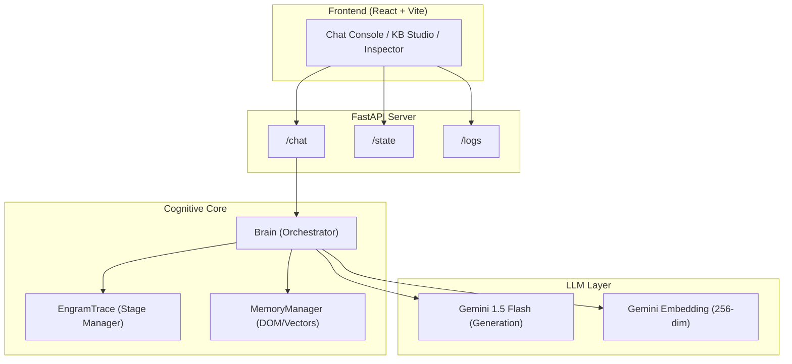

# EngramTrace

A non-parametric cognitive memory system that augments Large Language Models with persistent, structured long-term memory. Unlike standard RAG systems that use flat vector stores, EngramTrace maintains a **living HTML document** as its knowledge base, where the DOM structure itself encodes semantic relationships.

## 🧠 Cognitive Philosophy
EngramTrace mimics the human biological cycle of memory consolidation:
1. **Encoding**: Conversations are buffered in a temporary Stage Log.
2. **Retrieval (Ecphory)**: Relevant knowledge is retrieved via hierarchical vector search with structural awareness.
3. **Reconsolidation**: When a topic shift (drift) is detected, the buffer is synthesized and merged back into the long-term HTML structure.

---

## 🏗 Architecture Overview



### Key Technical Innovations
- **Hierarchical Embedding Summation**: Paragraph vectors are summed with their structural ancestors (sections, bodies), giving each leaf node implicit awareness of its context within the knowledge tree.
- **Dual-Threshold Control**: Independent triggers for **Stage Drift** (topic switching) and **Semantic Search** (knowledge retrieval).
- **Homeostatic Day System**: Automatic background compression and reorganization of the entire knowledge base to maintain logical density over time.

---

## 🚀 System Pipeline

### 1. Initialization (Atomization)
The system converts unstructured information into a structured HTML document. Every node is assigned a deterministic ID, and hierarchical embeddings are generated to map the initial conceptual landscape.

### 2. Retrieval & Inference (In-Stage)
Every interaction triggers a drift check. If the topic is consistent, relevant context is retrieved from the KB (Ecphory) and combined with the current stage history to generate a response. The exchange is buffered in a temporary `current_stage_log`.

### 3. Consolidation (Transition)
If a user drifts to a new topic, the system automatically synthesizes the previous stage log and grafts the new insights into the HTML DOM via a surgical "Upsert" logic, ensuring the knowledge base evolves additively.

### 4. Homeostasis (Day Change)
On significant time gaps, the system performs a "restructuring" pass. Older data is summarized and regrouped while preserving the chronological and logical evolution of ideas.

---

## 🛠 Tech Stack
- **Backend**: FastAPI, LangChain, BeautifulSoup4, NumPy
- **Frontend**: React 19, Vite, React Flow, CodeMirror
- **AI**: Google Gemini Pro (Flash), Gemini Embedding-001

---

## 🔧 Getting Started

### Prerequisites
- Python 3.12+
- Node.js 20+
- Google AI API Key

### Installation
1. **Backend**:
   ```bash
   cd backend
   python -m venv venv && source venv/bin/activate
   pip install -r requirements.txt
   # Set GOOGLE_API_KEY in .env
   python main.py
   ```
2. **Frontend**:
   ```bash
   cd frontend
   npm install
   npm run dev
   ```

---
*EngramTrace: Building memory that grows, consolidates, and forgets just like you do.*
