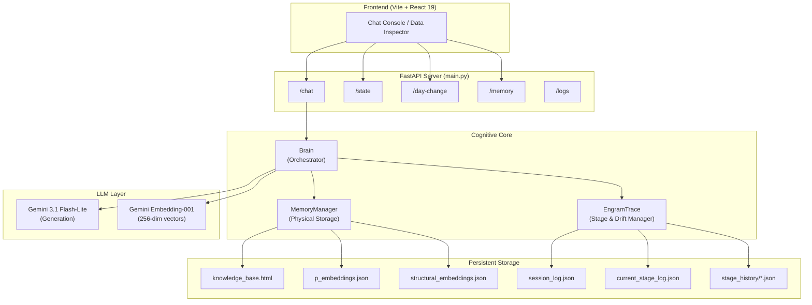
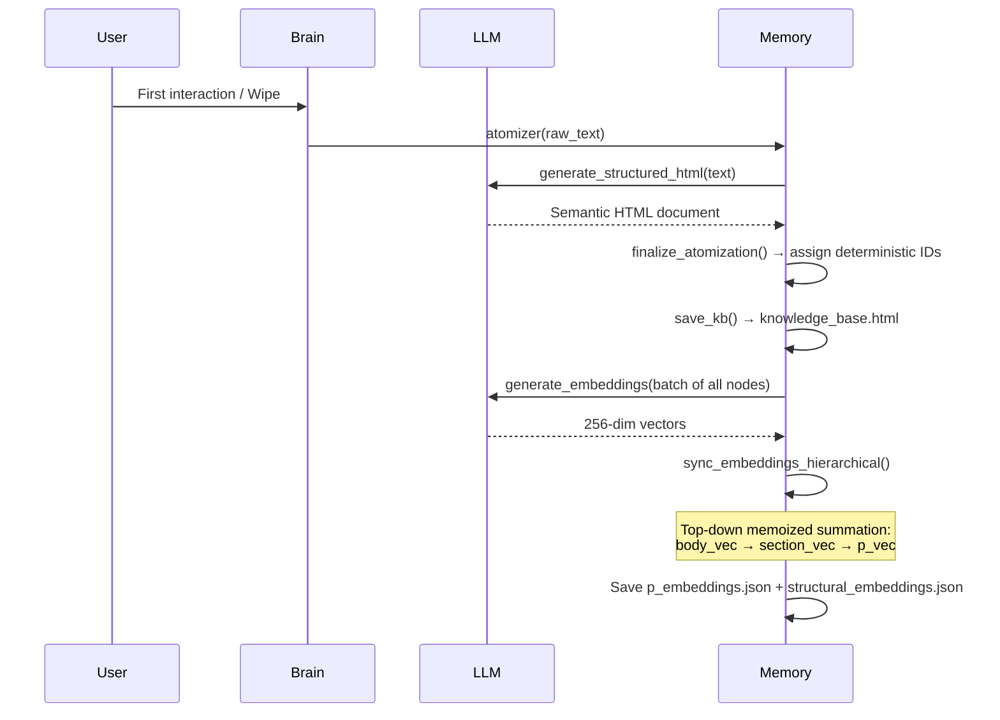
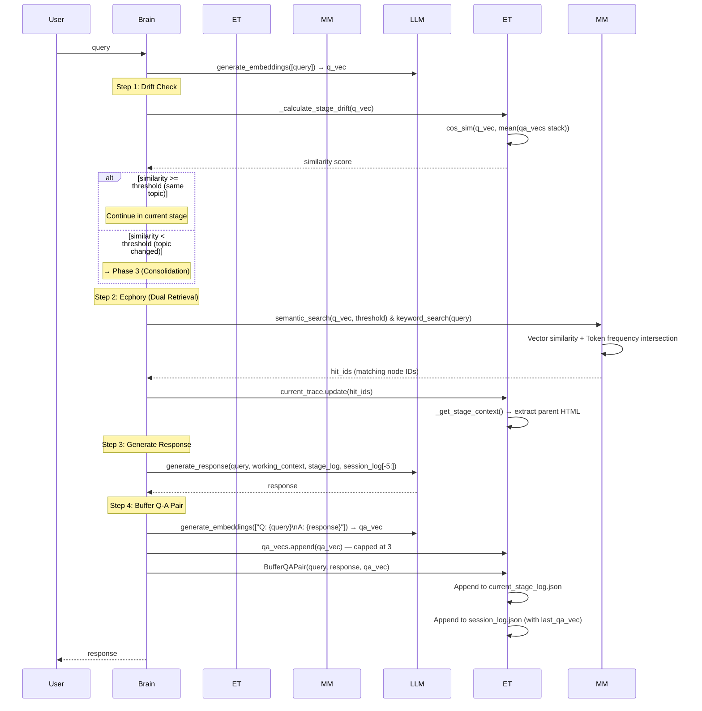
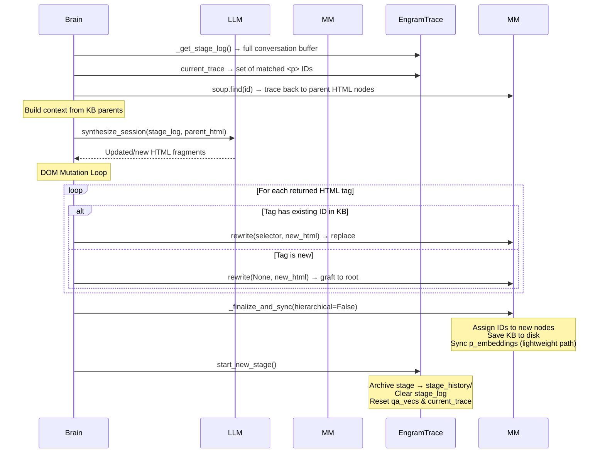

# EngramTrace — Technical Deep Dive Report

**Date:** April 15, 2026  
**Repository:** [github.com/iamtaehyunpark/EngramTrace](https://github.com/iamtaehyunpark/EngramTrace)

---

## 1. Executive Summary

EngramTrace is a **non-parametric cognitive memory system** that augments Large Language Models with persistent, structured long-term memory. Unlike RAG systems that use flat vector stores, EngramTrace maintains a **living HTML document** as its knowledge base — a hierarchical DOM tree where the structure itself encodes semantic relationships between concepts.

The core thesis is borrowed from neuroscience: human memory consolidates through a cycle of **encoding → retrieval → reconsolidation**. EngramTrace replicates this by:

1. **Encoding** user conversations into a temporary buffer (Stage Log)
2. **Retrieving** relevant past knowledge via hierarchical vector search (Ecphory)
3. **Reconsolidating** the buffer back into long-term storage when the topic shifts (Consolidation)

This produces a system that learns additively from every conversation without retraining model weights.

---

## 2. Architecture Overview



### Technology Stack

| Layer | Technology | Version |
|-------|-----------|---------|
| LLM Inference | Gemini 3.1 Flash-Lite | Preview |
| Embeddings | Gemini Embedding-001 | 256 dimensions |
| Orchestration | LangChain | Latest |
| Backend API | FastAPI + Uvicorn | Latest |
| HTML Parsing | BeautifulSoup4 (lxml) | Latest |
| Vector Math | NumPy | Latest |
| Frontend | React 19 + Vite 8 | Latest |
| Language | Python 3.13 / JavaScript ES2024 | — |

---

## 3. The Cognitive Pipeline (Full Data Flow)

The system operates in four distinct phases, mirroring the neuroscience model of memory consolidation:

### Phase 1: Initialization



**Key Detail — Hierarchical Embedding Summation:**  
Rather than embedding each `<p>` tag in isolation, the system generates embeddings for every structural ancestor (`body`, `main`, `section`, `article`, `div`) and sums them top-down:

```
p_vector = p_raw_embedding + section_vector
section_vector = section_raw_embedding + body_vector
body_vector = body_raw_embedding
```

This gives each paragraph vector implicit awareness of its structural context. A paragraph about "Mendota Lake" under the section "Madison Geography" will have a meaningfully different vector than the same text under "Fishing Destinations."

All ancestor embeddings are generated in a **single batch API call** and memoized to avoid redundant computation across sibling paragraphs sharing the same parent.

---

### Phase 2: Retrieval & Inference (In-Stage)

This is the standard chat loop — every user message triggers this flow:



**Key Design Decisions:**

1. **Q-A Pair Embeddings for Drift Detection:** Instead of comparing raw query vectors, the system embeds the full `"Q: ...\nA: ..."` pair. This captures the semantic direction of the entire exchange, not just the question. The `qa_vecs` stack is capped at 3 to weight recent turns.

2. **Dual-Threshold System:** Two independently configurable thresholds control the pipeline:
   - `stage_threshold` (default 0.83): How similar the current query must be to the running conversation mean to stay in the same "stage"
   - `search_threshold` (default 0.75): Minimum cosine similarity to retrieve a `<p>` tag from the KB

3. **Session Log Persistence:** The `last_qa_vec` field is maintained as a rolling pointer — only the most recent session log entry carries it. When a new entry is written, the field is deleted from the previous entry and added to the new one.

4. **Dynamic Query Vector Weighting:** The raw query vector (`q_vec`) is structurally bounded. For a new stage, it is added to the highest KB structural vector (e.g. root) to proactively anchor it. For ongoing sessions, it is weighted (70% current query, 30% previous QA vector) to maintain continuous topic trajectory smoothly.

---

### Phase 3: Stage Transition & Consolidation

When drift is detected (topic change), the temporary stage is merged into long-term memory:



**Critical Safety Mechanism — Root Protection:**  
If the LLM wraps its response in a `<main id="root">` container (attempting to replace the entire KB), the system detects this and unwraps it, iterating over child tags individually to prevent catastrophic overwrite.

---

### Phase 4: Day System (Homeostasis)

Triggered when more than ~67 minutes (`4000 seconds`) have elapsed since the last interaction and a topic drift is detected simultaneously:

```
1. Consolidate any unconsolidated stage log (if non-empty)
2. atomizer(compress=True) → LLM restructures the ENTIRE KB
3. sync_embeddings_hierarchical() → Full vector rebuild
```

The `compress=True` flag activates a different LLM prompt that focuses on **reorganization and logical grouping** rather than aggressive summarization, preserving the chronological evolution of ideas while giving priority to the most recent information.

---

## 4. File-by-File Code Reference

### Backend Core (`backend/src/core/`)

#### [brain.py](file:///Users/a/GitHub/EngramTrace/backend/src/core/brain.py) — The Orchestrator

| Class | Responsibility |
|-------|---------------|
| `EngramTrace` | Manages ephemeral state: the `qa_vecs` stack (capped at 3), `current_trace` set, stage/session log I/O, drift calculation, stage archival |
| `Brain` | Coordinates the full cognitive pipeline: drift detection → ecphory retrieval → LLM inference → buffering → consolidation |

**Key Methods:**

| Method | Purpose |
|--------|---------|
| `Brain.run_inference(query, stage_threshold, search_threshold)` | The main cognitive loop. Entry point for every user message. |
| `Brain.consolidate_and_transition()` | Merges stage log into KB via LLM synthesis + DOM mutations |
| `EngramTrace._calculate_stage_drift(q_vec)` | Cosine similarity against the mean of the `qa_vecs` stack. Falls back to `last_qa_vec` from session log if stack is empty. |
| `EngramTrace.BufferQAPair(query, response, qa_vec)` | Dual-write to stage log (ephemeral) and session log (permanent). Manages the rolling `last_qa_vec` pointer. |
| `EngramTrace.start_new_stage()` | Archives current stage, clears all ephemeral state |

---

#### [memory.py](file:///Users/a/GitHub/EngramTrace/backend/src/core/memory.py) — Physical Memory

| Method | Purpose |
|--------|---------|
| `atomizer(llm_client, raw_text, compress)` | LLM-driven HTML structuring. Routes to hierarchical embedding sync. |
| `_finalize_and_sync(llm_client, hierarchical)` | Assigns deterministic IDs → saves KB → routes to appropriate embedding sync |
| `sync_embeddings_hierarchical(llm_client, active_ids)` | Full top-down rebuild. Batch embeds all structural ancestors + p tags, then sums vectors with memoization. Writes both `p_embeddings.json` and `structural_embeddings.json`. |
| `sync_embeddings(llm_client, active_ids)` | Lightweight stage-update path. Loads structural cache read-only, sums new p tags against cached parent vectors. |
| `semantic_search(query_vector, threshold)` | Vectorized NumPy cosine similarity against all p embeddings. Returns matching IDs. |
| `keyword_search(query)` | Traditional token-based search applying stop-word reduction across all Knowledge Base tags dynamically. |
| `rewrite(selector, html)` | DOM mutation: replaces existing nodes by ID match, or grafts new nodes to root if no match found. |
| `finalize_atomization(html)` | Ensures every structural tag has a deterministic SHA-256-based ID |

---

### LLM Layer (`backend/src/llm/`)

#### [langchain_client.py](file:///Users/a/GitHub/EngramTrace/backend/src/llm/langchain_client.py) — LLM Interface

Four distinct LLM interaction modes, each with carefully tuned system prompts:

| Method | Model | Purpose |
|--------|-------|---------|
| `generate_structured_html(text, compress)` | Gemini 3.1 Flash-Lite | Converts raw text → structured HTML. Two prompt variants: standard (init) and compress (day change). |
| `synthesize_session(log, context_html)` | Gemini 3.1 Flash-Lite | Merges stage log into existing KB HTML fragments during consolidation. Outputs raw HTML tags, not full documents. |
| `generate_response(query, context, history, session_history)` | Gemini 3.1 Flash-Lite | Standard chat. Multi-turn message array with system prompt carrying KB context + stage log. |
| `generate_embeddings(texts)` | Gemini Embedding-001 | Batch embedding generation. 256-dimensional output. |

---

### API Surface (`backend/main.py`)

| Endpoint | Method | Purpose |
|----------|--------|---------|
| `/chat` | POST | `{ query, threshold?, semantic_threshold? }` → `{ response }` |
| `/state` | GET | Returns full system state: KB HTML, stage log, session log, active trace |
| `/day-change` | POST | Forces atomizer compression + stage reset (consolidates first if needed) |
| `/memory` | DELETE | Nuclear wipe: KB, all embeddings, all logs |
| `/logs` | GET/DELETE | Real-time stdout capture for frontend process output streaming |

**Stdout Capture System:** A custom `LogCapture` class intercepts `sys.stdout` to buffer all print statements. The frontend polls `/logs` every 400ms during inference to display real-time processing steps to the user.

---

### Frontend (`frontend/src/`)

**Single-Page Application** with two views:

1. **Chat Console:** Multi-line textarea with Enter-to-submit, live server log streaming during inference, and full session history rehydration on page load.
2. **Data Inspector:** Read-only view of the Engram Trace set, Stage Log JSON, and rendered KB HTML preview.

**Header Controls:**
- Drift Threshold slider (adjustable `stage_threshold`)
- Search Threshold slider (adjustable `search_threshold`)
- Force Day Change button
- Clear Total Memory button

Vite dev server proxies all `/chat`, `/state`, `/logs`, `/memory`, `/day-change` routes to the FastAPI backend at `http://127.0.0.1:8000`.

---

## 5. Data Storage Schema

### `knowledge_base.html` (~6KB current)
```html
<html>
 <body>
  <h1 id="h1-154c679750dc">지식 베이스</h1>
  <h2 id="h2-00172760fc87">1. 이란 정치 및 국제 관계</h2>
  <h3 id="h3-26a70f243076">현황</h3>
  <p id="p-87316b36f22e">2024년 7월 취임한 개혁파...</p>
  ...
 </body>
</html>
```
- IDs are deterministic: `SHA-256(text_content)[:12]` prefixed with tag name
- Currently flat structure (`body > h/p` siblings). Will gain depth as LLM generates nested `section`/`div` wrappers.

### `p_embeddings.json` (~54KB current)
```json
{
  "p-87316b36f22e": {
    "selector": "html > body > p#p-87316b36f22e",
    "vector": [0.012, -0.045, 0.089, ...],    // 256 floats, hierarchically summed
    "last_consolidated": "2026-04-06T..."
  }
}
```

### `structural_embeddings.json` (NEW)
```json
{
  "body-abc123": [0.012, -0.045, ...],    // Summed structural vectors, pure cache
  "section-def456": [0.034, -0.012, ...]
}
```

### `session_log.json` (~123KB current)
```json
[
  { "query": "...", "response": "...", "timestamp": "..." },
  { "query": "...", "response": "...", "timestamp": "...", "last_qa_vec": [0.01, ...] }
]
```
Only the **last** entry carries `last_qa_vec`. This serves as the drift detection fallback when the in-memory `qa_vecs` stack is empty (e.g., after a server restart).

### `current_stage_log.json` (~2.5KB current)
Identical format to session_log but without `last_qa_vec`. Cleared on every stage transition.

### `stage_history/stage_YYYYMMDD_HHMMSS.json`
Archived copies of completed stage logs. 16 archives currently exist. Purely for audit/debugging — not read by the system during runtime.

---

## 6. Current System Metrics

| Metric | Value |
|--------|-------|
| Knowledge Base size | 6.1 KB (113 lines of HTML) |
| P-Embeddings entries | 7 paragraph vectors |
| Session Log entries | ~123 KB of conversation history |
| Archived stages | 16 stage transitions recorded |
| Embedding dimensions | 256 per vector |
| LLM temperature | 0.1 (low, for structural consistency) |
| Drift threshold | 0.83 (configurable via UI) |
| Search threshold | 0.75 (configurable via UI) |
| Consolidation trigger | 10 Q-A pairs OR topic drift |
| Day change trigger | 4000+ seconds since last interaction |

---

## 7. Differentiation from Standard RAG

| Dimension | Standard RAG | EngramTrace |
|-----------|-------------|-------------|
| **Knowledge Storage** | Flat vector store (Pinecone, Chroma) | Hierarchical HTML DOM with structural semantics |
| **Learning** | Static — documents indexed once | Additive — KB evolves with every conversation |
| **Consolidation** | None | Drift-triggered merge of short-term buffer into long-term structure |
| **Context Window** | Retrieved chunks concatenated | Ecphory: structural parent tracing produces coherent context subtrees |
| **Embedding Strategy** | Independent chunk embeddings | Hierarchical summation: each vector carries its structural ancestry |
| **Memory Management** | Manual re-indexing | Automatic homeostasis via Day System compression |
| **Temporal Awareness** | None | Stage-based session tracking with chronological priority |

---

## 8. Known Limitations & Technical Debt

### Architecture
1. **Single-file KBs don't scale.** The entire HTML is loaded into BeautifulSoup in memory. At 100K+ lines, this will degrade. A sharding strategy (per-topic HTML files) would be needed for production scale.
2. **No concurrent access control.** The FastAPI endpoints are async but the Brain/Memory classes are not thread-safe. Simultaneous requests could corrupt the stage log or KB.
3. **LLM-dependent structure quality.** The HTML structure quality depends entirely on the LLM's formatting ability. Malformed output can introduce broken DOM trees.

### Performance
4. **Embedding API is the bottleneck.** Every inference cycle makes 2 API calls (query embedding + Q-A pair embedding). Consolidation adds 1 more (node re-embedding). Day change triggers a full batch rebuild.
5. **Session log grows unbounded.** `session_log.json` is 123KB after moderate use. It's read on every inference cycle (for session history context). Should be paginated or capped.
6. **No caching of LLM responses.** Identical queries re-trigger the full pipeline.

### Missing Features
7. **No authentication or multi-user support.**
8. **No streaming responses** (the UI polls for logs but the actual response is returned as a single block).
9. **No rollback mechanism.** If consolidation produces a bad KB merge, there's no undo.
10. **Frontend is developer-facing,** not production-ready UI.

---

## 9. Development & Deployment

### Local Development

```bash
# Backend
cd backend
python -m venv tmp_venv
source tmp_venv/bin/activate
pip install -r requirements.txt
# Set GOOGLE_API_KEY in .env
python main.py          # Starts on http://127.0.0.1:8000

# Frontend
cd frontend
npm install
npm run dev             # Starts on http://localhost:5173, proxies to backend
```

### Environment Variables
| Variable | Required | Description |
|----------|----------|-------------|
| `GOOGLE_API_KEY` | Yes | Google AI API key for Gemini models |

### Dependencies
**Backend:** `langchain`, `langchain-google-genai`, `fastapi`, `uvicorn`, `beautifulsoup4`, `lxml`, `numpy`  
**Frontend:** `react@19`, `react-dom@19`, `vite@8`

---

## 10. Recommended Next Steps

### Short-term (Engineering)
1. **Add structured error handling** — the LLM can return malformed HTML that crashes BeautifulSoup. Wrap all LLM outputs in validation.
2. **Cap session_log.json** — implement a rolling window or pagination to prevent unbounded growth.
3. **Add integration tests** — test files exist (`test_pipeline.py`, `test_consolidation.py`) but need to be kept current with the Q-A embedding changes.

### Medium-term (Product)
4. **Multi-user support** — each user gets their own KB, embeddings, and session state. Requires a storage backend (SQLite or Postgres).
5. **Streaming responses** — replace the polling log system with SSE or WebSocket for real-time token streaming.
6. **KB visualization** — render the HTML DOM as an interactive graph in the frontend, showing how knowledge clusters evolve over time.

### Long-term (Scale)
7. **Sharded knowledge bases** — split the monolithic HTML into per-topic sub-documents with a routing layer.
8. **Pluggable LLM backends** — abstract the Gemini dependency for OpenAI/Anthropic/local model support.
9. **Evaluation framework** — measure retrieval precision, consolidation quality, and drift detection accuracy against ground truth datasets.

---

*This report reflects the codebase state as of April 15, 2026. All file references link directly to the source.*
