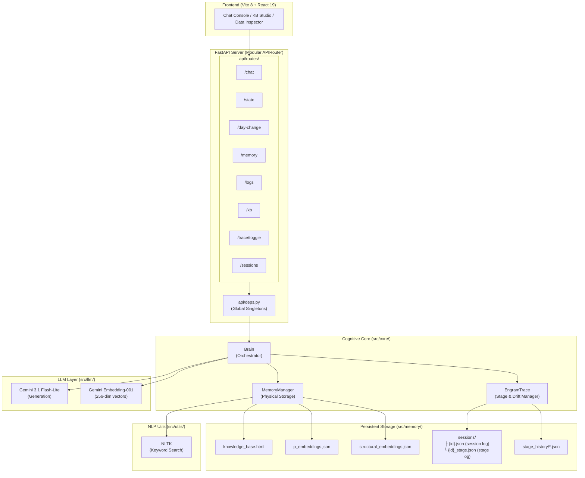
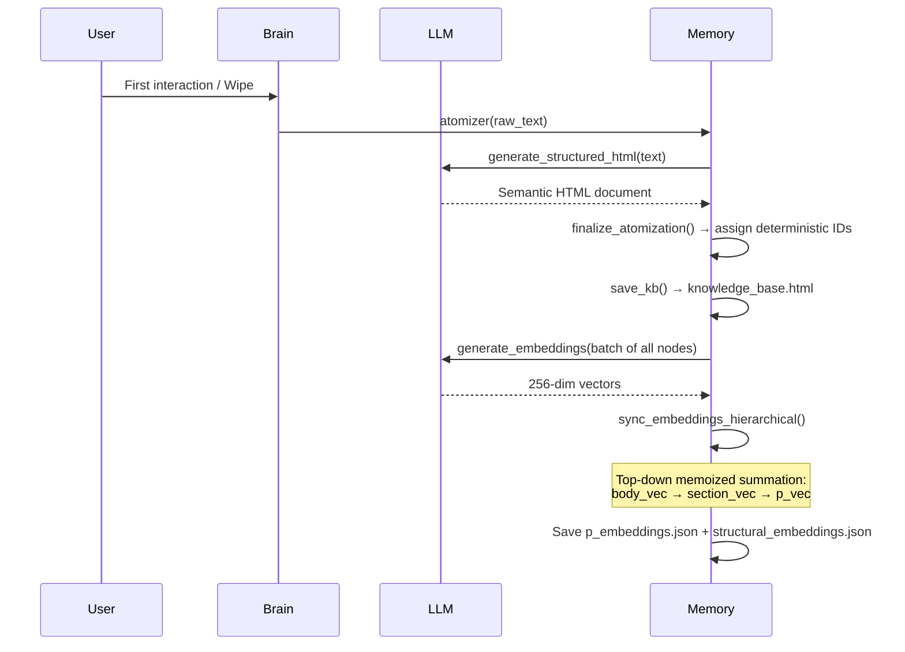
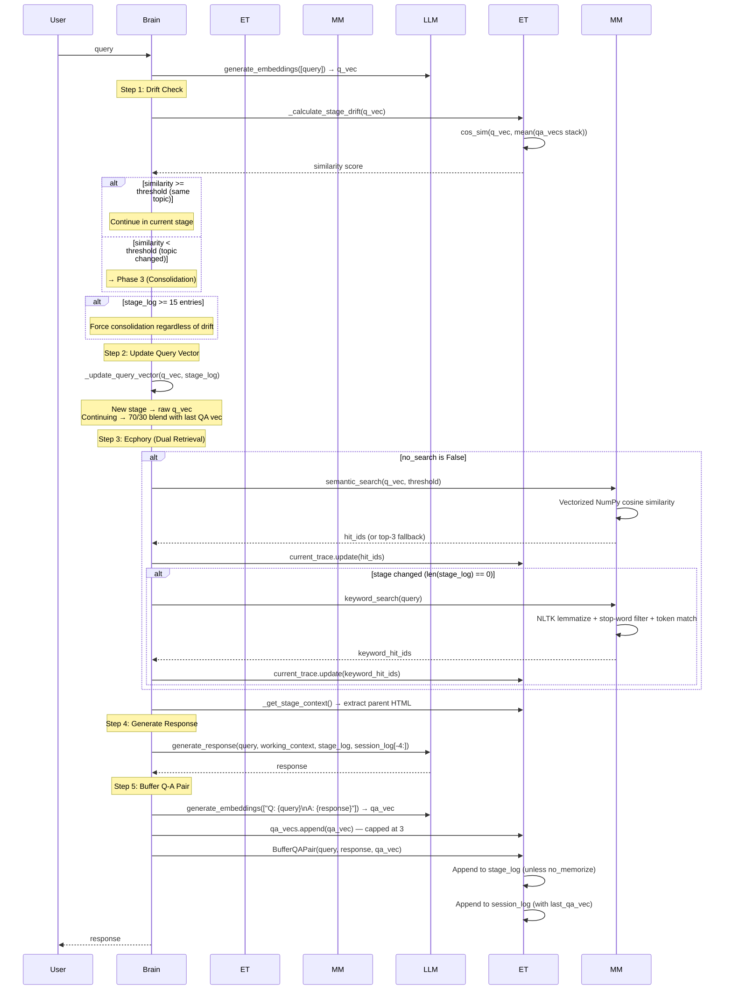
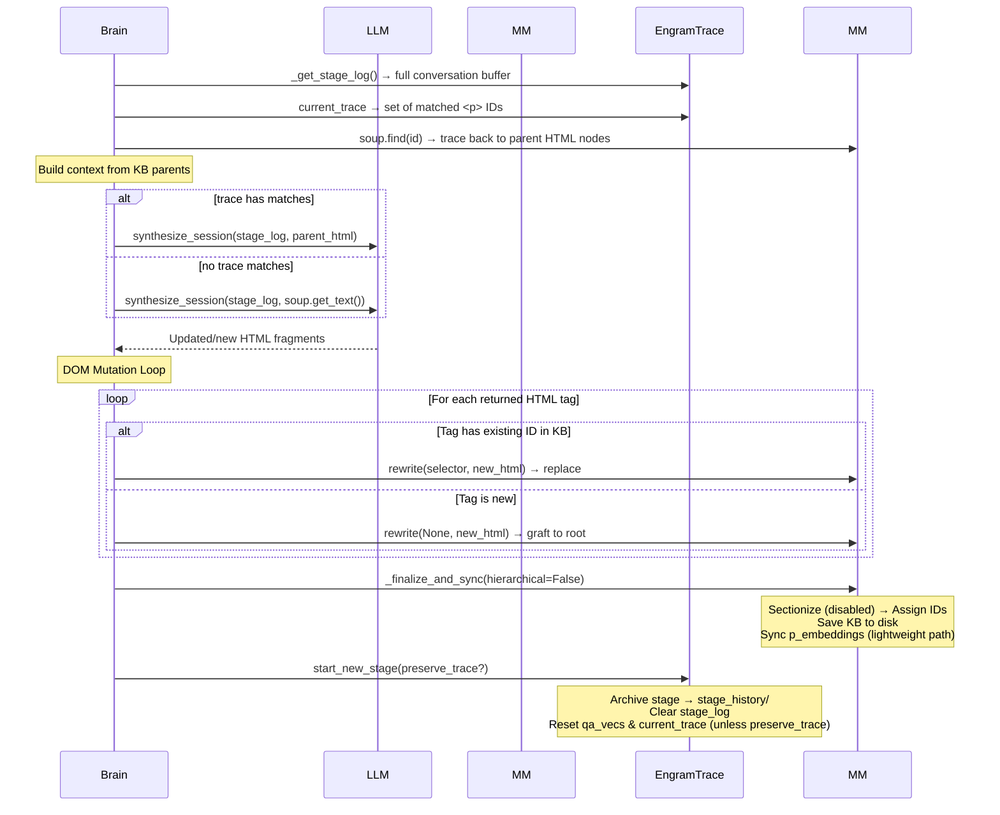

# EngramTrace — Technical Deep Dive Report

**Date:** April 19, 2026  
**Repository:** [github.com/iamtaehyunpark/EngramTrace](https://github.com/iamtaehyunpark/EngramTrace)

---

## 1. Executive Summary

EngramTrace is a **non-parametric cognitive memory system** that augments Large Language Models with persistent, structured long-term memory. Unlike RAG systems that use flat vector stores, EngramTrace maintains a **living HTML document** as its knowledge base — a hierarchical DOM tree where the structure itself encodes semantic relationships between concepts.

The core thesis is borrowed from neuroscience: human memory consolidates through a cycle of **encoding → retrieval → reconsolidation**. EngramTrace replicates this by:

1. **Encoding** user conversations into a temporary buffer (Stage Log)
2. **Retrieving** relevant past knowledge via dual-mode search — hierarchical vector similarity (Ecphory) combined with NLTK-powered keyword search
3. **Reconsolidating** the buffer back into long-term storage when the topic shifts (Consolidation)

This produces a system that learns additively from every conversation without retraining model weights.

---

## 2. Architecture Overview



### Technology Stack

| Layer | Technology | Details |
|-------|-----------|---------|
| LLM Inference | Gemini 3.1 Flash-Lite (Preview) | Temperature 0.1 |
| Embeddings | Gemini Embedding-001 | 256 dimensions (configurable local fallback: Jina v5 commented out) |
| Orchestration | LangChain | `langchain-google-genai`, `langchain-core` |
| Backend API | FastAPI + Uvicorn | Modular APIRouter structure |
| HTML Parsing | BeautifulSoup4 (lxml) | DOM manipulation & structural traversal |
| Vector Math | NumPy | Vectorized cosine similarity |
| NLP / Keyword | NLTK | Stop-word filtering, lemmatization, tokenization |
| Frontend | React 19 + Vite 8 | SPA with CodeMirror editor & React Flow graph |
| KB Visualization | @xyflow/react + dagre | Interactive DOM graph with auto-layout |
| Code Editor | @uiw/react-codemirror | Catppuccin-themed HTML editor |
| Markdown | react-markdown | Chat response rendering |
| Language | Python 3.13 / JavaScript ES2024 | — |

---

## 3. The Cognitive Pipeline (Full Data Flow)

The system operates in four distinct phases, mirroring the neuroscience model of memory consolidation:

### Phase 1: Initialization



**Key Detail — Hierarchical Embedding Summation:**  
Rather than embedding each `<p>` tag in isolation, the system generates embeddings for every structural ancestor (`body`, `main`, `section`, `article`, `div`) and combines them top-down using a **weighted distribution (70% local node / 30% structural parent)**:

```
p_vector = (p_raw_embedding * 0.7) + (section_vector * 0.3)
section_vector = (section_raw_embedding * 0.7) + (body_vector * 0.3)
body_vector = body_raw_embedding
```

This exponential decay logic gives each paragraph vector implicit awareness of its structural context without permanently diluting its local focal meaning. A paragraph about "Mendota Lake" under the section "Madison Geography" will have a meaningfully different vector than the same text under "Fishing Destinations."

All ancestor embeddings are generated in a **single batch API call** and memoized to avoid redundant computation across sibling paragraphs sharing the same parent.

**Sectionization (Currently Disabled):**  
The `_sectionize()` method exists to convert flat heading+content sibling sequences into nested `<section>` blocks, but is currently commented out in `_finalize_and_sync()`. The LLM prompts now instruct the model to output properly nested `<section>` tags directly.

---

### Phase 2: Retrieval & Inference (In-Stage)

This is the standard chat loop — every user message triggers this flow:



**Key Design Decisions:**

1. **Q-A Pair Embeddings for Drift Detection:** Instead of comparing raw query vectors, the system embeds the full `"Q: ...\nA: ..."` pair. This captures the semantic direction of the entire exchange, not just the question. The `qa_vecs` stack is capped at 3 to weight recent turns.

2. **Dual Retrieval with Keyword Fallback:** Two retrieval strategies operate in tandem:
   - **Semantic search:** Vectorized NumPy cosine similarity against all p-embeddings with a configurable threshold (default 0.80). If zero results pass the threshold, a **Top-3 Fallback** retrieves the highest matches regardless of score.
   - **Keyword search:** NLTK-powered traditional search using lemmatization, stop-word removal, and token frequency counting. Activated **only on stage transitions** (when the stage log is empty) to supplement semantic search for unfamiliar topics.

3. **Force Consolidation at 15 Q-A Pairs:** Independent of drift detection, the system force-consolidates once the stage log reaches 15 entries to prevent unbounded stage growth.

4. **`no_search` and `no_memorize` Modes:** The chat endpoint supports two inference control flags:
   - `no_search`: Skips ecphory retrieval and uses only the existing trace as context. Useful for restricting conversation to the current working set.
   - `no_memorize`: Skips appending to the stage log (but still appends to session log). Used during evaluation to prevent test questions from contaminating the knowledge base.

5. **Session Log Persistence:** The `last_qa_vec` field is maintained as a rolling pointer — only the most recent session log entry carries it. When a new entry is written, the field is deleted from the previous entry and added to the new one.

6. **Dynamic Query Vector Weighting:** For a new stage, the raw query vector is used directly. For ongoing sessions, the query vector is blended (70% current query, 30% previous QA vector) to maintain continuous topic trajectory. *(Note: the original structural root anchoring for new-stage queries is currently commented out.)*

---

### Phase 3: Stage Transition & Consolidation

When drift is detected (topic change) or the 15-entry cap is reached, the temporary stage is merged into long-term memory:



**Critical Safety Mechanism — Root Protection:**  
If the LLM wraps its response in a `<main id="root">` container (attempting to replace the entire KB), the system detects this and unwraps it, iterating over child tags individually to prevent catastrophic overwrite.

**`preserve_trace` Flag:**  
When `no_search` is active or during evaluation bulk ingestion, the trace is preserved across consolidation boundaries so that the working context set accumulates across multiple consolidation cycles.

---

### Phase 4: Day System (Homeostasis)

Triggered when more than ~67 minutes (`4000 seconds`) have elapsed since the last interaction and a topic drift is detected simultaneously:

```
1. Consolidate any unconsolidated stage log (if non-empty)
2. atomizer(compress=True) → LLM restructures the ENTIRE KB
3. sync_embeddings_hierarchical() → Full vector rebuild
```

The `compress=True` flag activates a different LLM prompt that focuses on **reorganization and logical grouping** rather than aggressive summarization, preserving the chronological evolution of ideas while giving priority to the most recent information.

---

## 4. File-by-File Code Reference

### Backend Entry Point

#### [main.py](file:///Users/a/GitHub/EngramTrace/backend/main.py) — FastAPI Application Factory

Initializes the FastAPI application, loads `.env` variables, configures CORS middleware, and registers the modular APIRouter modules. Starts Uvicorn on `http://127.0.0.1:8000`.

---

### API Layer (`backend/api/`)

#### [deps.py](file:///Users/a/GitHub/EngramTrace/backend/api/deps.py) — Global Singletons & Log Capture

Instantiates the global `LangChainClient`, `MemoryManager`, and `Brain` objects used across all route handlers. Also implements the `LogCapture` class that intercepts `sys.stdout` to buffer all print statements for frontend polling.

| Singleton | Class | Purpose |
|-----------|-------|---------|
| `llm` | `LangChainClient` | LLM inference and embedding generation |
| `memory` | `MemoryManager` | Physical KB and embedding storage |
| `brain` | `Brain` | Cognitive pipeline orchestrator |
| `log_capture` | `LogCapture` | Stdout interception for real-time log streaming |

---

### API Routes (`backend/api/routes/`)

#### [chat.py](file:///Users/a/GitHub/EngramTrace/backend/api/routes/chat.py) — Chat Endpoint

| Endpoint | Method | Body | Purpose |
|----------|--------|------|---------|
| `/chat` | POST | `{ query, threshold?, semantic_threshold?, no_search?, no_memorize? }` | Entry point for the cognitive loop. Returns `{ response }`. |

#### [memory.py](file:///Users/a/GitHub/EngramTrace/backend/api/routes/memory.py) — KB & Trace Management

| Endpoint | Method | Body | Purpose |
|----------|--------|------|---------|
| `/memory` | DELETE | `{ knowledge_base?, session_log?, stage_log?, current_trace? }` | Selective memory wipe with per-component control |
| `/kb` | PUT | `{ html }` | Accepts raw HTML from frontend editor, re-parses, finalizes IDs, and rebuilds all embeddings (hierarchical) |
| `/trace/toggle` | POST | `{ id }` | Toggles a node ID in the active engram trace set (add/remove) |

#### [system.py](file:///Users/a/GitHub/EngramTrace/backend/api/routes/system.py) — System & Session Management

| Endpoint | Method | Purpose |
|----------|--------|---------|
| `/logs` | GET | Returns captured stdout log array |
| `/logs` | DELETE | Clears the log buffer |
| `/day-change` | POST | Forces atomizer compression + stage reset |
| `/state` | GET | Returns full system state: KB HTML, stage log, session log, active trace |
| `/sessions` | GET | Lists all available sessions and the active session ID |
| `/sessions/{id}` | POST | Creates/selects a session |
| `/sessions/{id}` | DELETE | Deletes a session and its stage log; switches to `default` if active |

---

### Backend Core (`backend/src/core/`)

#### [brain.py](file:///Users/a/GitHub/EngramTrace/backend/src/core/brain.py) — The Orchestrator

Contains two classes:

| Class | Responsibility |
|-------|---------------|
| `EngramTrace` | Manages ephemeral state: the `qa_vecs` stack (capped at 3), `current_trace` set, multi-session log I/O, drift calculation, stage archival. Owns the `sessions/` directory and manages per-session state via `set_session()`. |
| `Brain` | Coordinates the full cognitive pipeline: drift detection → ecphory retrieval → LLM inference → buffering → consolidation. On initialization, reconstructs `qa_vecs` from the last 3 stage log entries. |

**Key Methods — EngramTrace:**

| Method | Purpose |
|--------|---------|
| `set_session(session_id)` | Switches active session, creating log files if needed. Per-session `current_trace` and `qa_vecs` stored in `self.sessions` dict. |
| `_calculate_stage_drift(q_vec)` | Cosine similarity against the mean of the `qa_vecs` stack. Falls back to `last_qa_vec` from session log if stack is empty. Returns 0.0 if no history exists. |
| `BufferQAPair(query, response, qa_vec, no_memorize)` | Dual-write to stage log (ephemeral, skipped if `no_memorize`) and session log (permanent). Manages the rolling `last_qa_vec` pointer. |
| `start_new_stage(preserve_trace)` | Archives current stage, clears all ephemeral state. Optionally preserves the trace set across transitions. |
| `_get_stage_context()` | Traces matched `<p>` IDs to their parent nodes and returns their outer HTML as context. |
| `wipe(wipe_stage, wipe_session, wipe_trace)` | Selective wipe with per-component granularity. Also purges `stage_history/` when wiping stages. |

**Key Methods — Brain:**

| Method | Purpose |
|--------|---------|
| `run_inference(query, stage_threshold, search_threshold, no_search, no_memorize)` | The main cognitive loop. Entry point for every user message. |
| `consolidate_and_transition(preserve_trace)` | Merges stage log into KB via LLM synthesis + DOM mutations. Falls back to full KB text if no trace matches exist. |
| `_update_query_vector(q_vec, stage_log)` | Blends raw query vector with last QA vector (70/30) for continuing stages. Uses raw vector for new stages. |

---

#### [memory.py](file:///Users/a/GitHub/EngramTrace/backend/src/core/memory.py) — Physical Memory

| Method | Purpose |
|--------|---------|
| `atomizer(llm_client, raw_text, compress)` | LLM-driven HTML structuring. Routes to hierarchical embedding sync. |
| `_sectionize()` | Deterministic heading-to-section nester (currently disabled in `_finalize_and_sync`). |
| `_finalize_and_sync(llm_client, hierarchical)` | Assigns deterministic IDs → saves KB → routes to appropriate embedding sync |
| `sync_embeddings_hierarchical(llm_client, active_ids)` | Full top-down rebuild. Batch embeds all structural ancestors + p tags, then sums vectors with memoization. Writes both `p_embeddings.json` and `structural_embeddings.json`. |
| `sync_embeddings(llm_client, active_ids)` | Lightweight stage-update path. Loads structural cache read-only, sums new p tags against cached parent vectors. Prunes dead p selectors. |
| `semantic_search(query_vector, threshold)` | Vectorized NumPy cosine similarity against all p embeddings. Returns matching IDs or top-3 fallback if none pass threshold. |
| `keyword_search(query)` | NLTK-powered token-based search with lemmatization and stop-word filtering. Scores nodes by keyword hit count. Searches `<p>` and `<li>` tags. |
| `rewrite(selector, html)` | DOM mutation: replaces existing nodes by `tag#id` lookup, or grafts new nodes to root if no match found. |
| `finalize_atomization(html)` | Ensures every structural tag (p, h1–h6, article, section, div, main, span, b, strong, i, em, u) has a deterministic SHA-256-based ID. |

---

### LLM Layer (`backend/src/llm/`)

#### [langchain_client.py](file:///Users/a/GitHub/EngramTrace/backend/src/llm/langchain_client.py) — LLM Interface

Four distinct LLM interaction modes, each with carefully tuned system prompts:

| Method | Model | Purpose |
|--------|-------|---------|
| `generate_structured_html(text, compress)` | Gemini 3.1 Flash-Lite | Converts raw text → structured HTML. Two prompt variants: standard (init) and compress (day change). Both instruct nested `<section>` tag output. |
| `synthesize_session(log, context_html)` | Gemini 3.1 Flash-Lite | Merges stage log into existing KB HTML fragments during consolidation. Outputs raw HTML tags, not full documents. |
| `generate_response(query, context, history, session_history)` | Gemini 3.1 Flash-Lite | Standard chat. Multi-turn message array with system prompt carrying KB context + stage log. Session history replayed as `HumanMessage`/`AIMessage` pairs for continuity. |
| `generate_embeddings(texts)` | Gemini Embedding-001 | Batch embedding generation. 256-dimensional output via `embed_documents()`. |

**Local Embedding Fallback (Commented Out):**  
The codebase has a prepared fallback to `jinaai/jina-embeddings-v5-text-small` via `langchain-huggingface` + `sentence-transformers`. Dependencies are listed in `requirements.txt` but the import is commented out. When enabled, uses `truncate_dim=256` for API-compatible output.

---

### NLP Utilities (`backend/src/utils/`)

#### [nlp.py](file:///Users/a/GitHub/EngramTrace/backend/src/utils/nlp.py) — NLTK Integration

Auto-downloads required NLTK data (`stopwords`, `punkt`, `punkt_tab`, `wordnet`) on first import. Exports:
- `nltk_stop_words` — English stop word set
- `lemmatizer` — `WordNetLemmatizer` instance
- `word_tokenize` — NLTK tokenizer

Used by `MemoryManager.keyword_search()` for aggressive token normalization.

---

### Instrumentation

All methods across `MemoryManager`, `EngramTrace`, `Brain`, and `LangChainClient` are decorated with `@trace_timing`, which logs function start time and total execution duration to stdout. These timings are surfaced to the frontend via the `/logs` polling system.

---

### Frontend (`frontend/src/`)

**Single-Page Application** with three views and a session sidebar:

1. **Chat Console** (`App.jsx`):
   - Multi-line textarea with Enter-to-submit (Shift+Enter for newline)
   - Live server log streaming during inference (polled every 400ms via `/logs`)
   - Full session history rehydration on page load via `/state`
   - ReactMarkdown rendering for bot responses
   - Inference control toggles: "Restrict to current trace" (`no_search`) and "Do not memorize" (`no_memorize`)

2. **KB Studio** (`KBStudio.jsx`):
   - **HTML Editor tab:** Full CodeMirror editor with Catppuccin dark theme, syntax highlighting, line numbers, code folding, and bracket matching. Source/Preview toggle with rendered HTML preview. Save-to-backend button that triggers `/kb` PUT (re-parses, finalizes IDs, rebuilds all embeddings).
   - **DOM Graph tab:** Interactive React Flow visualization of the KB's DOM tree using dagre auto-layout (top-down). Color-coded nodes by tag type (`KBNode.jsx`). Retrieved/traced nodes highlighted in gold with animated edge ancestry. Click-to-toggle trace membership via `/trace/toggle`.

3. **Data Inspector** (`LogsView` in `App.jsx`):
   - Read-only JSON view of the active Engram Trace set, Stage Log, and Session Log.

4. **Session Sidebar** (`App.jsx`):
   - Lists all available sessions from `/sessions`
   - Create new sessions, switch between sessions (triggers page reload)
   - Delete sessions (with confirmation; cannot delete `default`)
   - Visual indicator of the currently active session

**Header Controls:**
- Drift Threshold numeric input (adjustable `stage_threshold`, default 0.83)
- Search Threshold numeric input (adjustable `search_threshold`, default 0.80)
- Selective Wipe dropdown (per-component: KB, session log, stage log, trace)
- Force Day Change button

**Frontend Dependencies:**

| Package | Purpose |
|---------|---------|
| `react@19` / `react-dom@19` | UI framework |
| `vite@8` | Dev server & bundler |
| `@uiw/react-codemirror` | HTML code editor |
| `@codemirror/lang-html` | HTML syntax support |
| `@uiw/codemirror-themes` | Custom theme support |
| `@xyflow/react` | DOM graph visualization |
| `dagre` | Automatic graph layout |
| `react-markdown` | Chat response rendering |

Vite dev server proxies `/chat`, `/state`, `/logs`, `/memory`, `/day-change`, `/kb`, `/trace`, `/sessions` routes to the FastAPI backend at `http://127.0.0.1:8000`.

---

## 5. Data Storage Schema

### `knowledge_base.html`
```html
<html>
 <body>
  <main id="root">
   <section>
    <h1 id="h1-154c679750dc">지식 베이스</h1>
    <section>
     <h2 id="h2-00172760fc87">1. 이란 정치 및 국제 관계</h2>
     <section>
      <h3 id="h3-26a70f243076">현황</h3>
      <p id="p-87316b36f22e">2024년 7월 취임한 개혁파...</p>
     </section>
    </section>
   </section>
  </main>
 </body>
</html>
```
- IDs are deterministic: `SHA-256(text_content)[:12]` prefixed with tag name
- Structure is LLM-generated with nested `<section>` wrappers per heading hierarchy

### `p_embeddings.json`
```json
{
  "p-87316b36f22e": {
    "selector": "html > body > main#root > section > section > p#p-87316b36f22e",
    "vector": [0.012, -0.045, 0.089, ...],    // 256 floats, hierarchically summed
    "last_consolidated": "2026-04-06T..."
  }
}
```

### `structural_embeddings.json`
```json
{
  "body-abc123": [0.012, -0.045, ...],    // Summed structural vectors, pure cache
  "section-def456": [0.034, -0.012, ...]
}
```

### `sessions/{session_id}.json` (Session Log)
```json
[
  { "query": "...", "response": "...", "timestamp": "..." },
  { "query": "...", "response": "...", "timestamp": "...", "last_qa_vec": [0.01, ...] }
]
```
Only the **last** entry carries `last_qa_vec`. This serves as the drift detection fallback when the in-memory `qa_vecs` stack is empty (e.g., after a server restart).

### `sessions/{session_id}_stage.json` (Stage Log)
Identical format to session log but without `last_qa_vec`. Cleared on every stage transition.

### `stage_history/stage_YYYYMMDD_HHMMSS.json`
Archived copies of completed stage logs. Purely for audit/debugging — not read by the system during runtime.

---

## 6. Multi-Session System

EngramTrace supports multiple independent chat sessions through the `sessions/` directory structure:

- Each session gets its own `{id}.json` (session log) and `{id}_stage.json` (stage log)
- Per-session ephemeral state (`current_trace`, `qa_vecs`) stored in `EngramTrace.sessions` dict
- Default session ID: `"default"` (auto-migrates legacy `session_log.json` / `current_stage_log.json`)
- The **Knowledge Base is shared** across all sessions — all sessions read and write to the same `knowledge_base.html`
- Session switching is exposed via the frontend sidebar and `/sessions` API routes

---

## 7. Evaluation Framework

EngramTrace has been benchmarked against **LongMemEval**, a standardized evaluation framework for long-term conversational memory systems.

### Evaluation Harness (`evaluate_engramtrace.py`)
- Imports `brain` and `llm` directly from `api.deps` for headless operation
- For each test item: wipes state → ingests haystack sessions via `BufferQAPair` → consolidates at 15-pair intervals → queries with `no_memorize=True`
- Results output as JSONL for GPT-4o-based answer evaluation

### LongMemEval Integration (`LongMemEval/`)
- Full benchmark codebase included as a Git submodule
- Evaluation scorer: `LongMemEval/src/evaluation/evaluate_qa.py`
- Test categories: single-session-assistant, single-session-user, multi-session, temporal-reasoning, knowledge-update, single-session-preference

### Evaluation Scripts
| Script | Purpose |
|--------|---------|
| `run_full_eval.sh` | Full batch evaluation with logging |
| `pause_eval_resume.sh` | Interruptible evaluation with resume support |

---

## 8. Current System Metrics

| Metric | Value |
|--------|-------|
| Embedding dimensions | 256 per vector |
| LLM temperature | 0.1 (low, for structural consistency) |
| Drift threshold (default) | 0.83 (configurable via UI) |
| Search threshold (default) | 0.80 (configurable via UI) |
| Force consolidation trigger | 15 Q-A pairs in current stage |
| Day change trigger | 4000+ seconds since last interaction |
| QA vector stack depth | 3 (most recent turns for drift calculation) |
| Session history window | Last 4 entries passed to LLM |
| Keyword search | NLTK lemmatized, stop-word filtered, min token length 3 |
| Semantic search fallback | Top-3 by similarity if no results above threshold |

---

## 9. Differentiation from Standard RAG

| Dimension | Standard RAG | EngramTrace |
|-----------|-------------|-------------|
| **Knowledge Storage** | Flat vector store (Pinecone, Chroma) | Hierarchical HTML DOM with structural semantics |
| **Learning** | Static — documents indexed once | Additive — KB evolves with every conversation |
| **Consolidation** | None | Drift-triggered merge of short-term buffer into long-term structure |
| **Context Window** | Retrieved chunks concatenated | Ecphory: structural parent tracing produces coherent context subtrees |
| **Embedding Strategy** | Independent chunk embeddings | Hierarchical summation: each vector carries its structural ancestry |
| **Memory Management** | Manual re-indexing | Automatic homeostasis via Day System compression |
| **Temporal Awareness** | None | Stage-based session tracking with chronological priority |
| **Retrieval Strategy** | Vector-only | Dual: semantic vector search + NLTK keyword search |
| **KB Editing** | Developer tools only | In-browser CodeMirror editor + live DOM graph visualization |
| **Multi-Session** | Typically single context | Named sessions with shared knowledge base |

---

## 10. Known Limitations & Technical Debt

### Architecture
1. **Single-file KBs don't scale.** The entire HTML is loaded into BeautifulSoup in memory. At 100K+ lines, this will degrade. A sharding strategy (per-topic HTML files) would be needed for production scale.
2. **No concurrent access control.** The FastAPI endpoints are async but the Brain/Memory classes are not thread-safe. Simultaneous requests could corrupt the stage log or KB.
3. **LLM-dependent structure quality.** The HTML structure quality depends entirely on the LLM's formatting ability. Malformed output can introduce broken DOM trees.
4. **Shared KB across sessions.** All sessions read/write the same knowledge base, meaning consolidation from one session can affect retrieval in another.

### Performance
5. **Embedding API is the bottleneck.** Every inference cycle makes 2 API calls (query embedding + Q-A pair embedding). Consolidation adds 1 more (node re-embedding). Day change triggers a full batch rebuild.
6. **Session log grows unbounded.** Session logs are stored as monolithic JSON files with no pagination or rolling window.
7. **No caching of LLM responses.** Identical queries re-trigger the full pipeline.
8. **`_sectionize()` is disabled.** The deterministic sectionizer exists but is commented out, relying entirely on LLM output quality for nested structure.

### Missing Features
9. **No authentication or multi-user support.**
10. **No streaming responses** (the UI polls for logs but the actual response is returned as a single block).
11. **No rollback mechanism.** If consolidation produces a bad KB merge, there's no undo.
12. **LongMemEval evaluation produces NaN metrics.** The current benchmark run shows NaN across all categories, indicating evaluation pipeline issues to investigate.

---

## 11. Development & Deployment

### Local Development

```bash
# Backend
cd backend
python -m venv tmp_venv
source tmp_venv/bin/activate
pip install -r requirements.txt
# Set GOOGLE_API_KEY in .env
python main.py          # Starts on http://127.0.0.1:8000

# Frontend
cd frontend
npm install
npm run dev             # Starts on http://localhost:5173, proxies to backend
```

### Environment Variables
| Variable | Required | Description |
|----------|----------|-------------|
| `GOOGLE_API_KEY` | Yes | Google AI API key for Gemini models |

### Dependencies
**Backend:** `langchain`, `langchain-google-genai`, `fastapi`, `uvicorn`, `beautifulsoup4`, `lxml`, `numpy`, `nltk` + optional: `langchain-huggingface`, `sentence-transformers`, `torch`, `peft` (for local embeddings)  
**Frontend:** `react@19`, `react-dom@19`, `vite@8`, `@uiw/react-codemirror`, `@codemirror/lang-html`, `@xyflow/react`, `dagre`, `react-markdown`

### Project Structure
```
EngramTrace/
├── backend/
│   ├── main.py                        # FastAPI app factory
│   ├── requirements.txt               # Python dependencies
│   ├── .env                           # GOOGLE_API_KEY
│   ├── api/
│   │   ├── deps.py                    # Global singletons & LogCapture
│   │   └── routes/
│   │       ├── chat.py                # /chat endpoint
│   │       ├── memory.py             # /memory, /kb, /trace endpoints
│   │       └── system.py             # /logs, /state, /day-change, /sessions
│   ├── src/
│   │   ├── core/
│   │   │   ├── brain.py              # EngramTrace + Brain classes
│   │   │   └── memory.py             # MemoryManager class
│   │   ├── llm/
│   │   │   └── langchain_client.py   # LangChainClient class
│   │   ├── utils/
│   │   │   └── nlp.py                # NLTK setup & exports
│   │   └── memory/
│   │       ├── knowledge_base.html   # Persistent KB
│   │       ├── p_embeddings.json     # Paragraph embeddings
│   │       ├── structural_embeddings.json
│   │       ├── sessions/             # Per-session logs
│   │       │   ├── {id}.json
│   │       │   └── {id}_stage.json
│   │       └── stage_history/        # Archived stage logs
│   └── tests/
│       └── test_memory_update.py
├── frontend/
│   ├── package.json
│   ├── vite.config.js                # Dev proxy config
│   └── src/
│       ├── main.jsx
│       ├── App.jsx                   # Main SPA: Chat + Sidebar + Logs
│       ├── App.css                   # Application styles
│       ├── index.css                 # CSS variables & resets
│       ├── KBStudio.jsx              # KB Editor + DOM Graph
│       └── KBNode.jsx                # Custom React Flow node
├── LongMemEval/                      # Benchmark submodule
├── evaluate_engramtrace.py           # Headless evaluation harness
├── run_full_eval.sh
├── pause_eval_resume.sh
└── engramtrace_technical_report.md   # This document
```

---

## 12. Recommended Next Steps

### Short-term (Engineering)
1. **Debug LongMemEval NaN results** — investigate the evaluation pipeline to produce valid accuracy metrics across all test categories.
2. **Add structured error handling** — the LLM can return malformed HTML that crashes BeautifulSoup. Wrap all LLM outputs in validation.
3. **Re-enable or remove `_sectionize()`** — either fix the deterministic sectionizer or fully commit to LLM-generated sections and remove dead code.
4. **Cap session log files** — implement a rolling window or pagination to prevent unbounded growth.
5. **Add integration tests** — test files exist (`test_pipeline.py`, `test_consolidation.py`, `tests/test_memory_update.py`) but need to be kept current with the multi-session and keyword search changes.

### Medium-term (Product)
6. **Multi-user support** — each user gets their own KB, embeddings, and session state. Requires a storage backend (SQLite or Postgres).
7. **Streaming responses** — replace the polling log system with SSE or WebSocket for real-time token streaming.
8. **Per-session knowledge bases** — allow sessions to optionally maintain isolated KBs, preventing cross-session contamination.
9. **Enable local embeddings** — activate the commented-out Jina v5 integration for offline/privacy-sensitive deployments.

### Long-term (Scale)
10. **Sharded knowledge bases** — split the monolithic HTML into per-topic sub-documents with a routing layer.
11. **Pluggable LLM backends** — abstract the Gemini dependency for OpenAI/Anthropic/local model support.
12. **Evaluation framework maturation** — produce reproducible LongMemEval scores and establish continuous benchmarking as the architecture evolves.

---

*This report reflects the codebase state as of April 19, 2026. All file references link directly to the source.*
